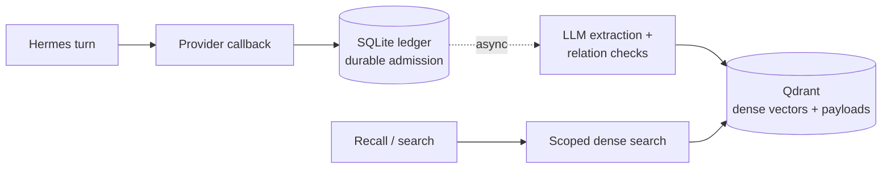

# Qdrant Memory for Hermes

[](https://github.com/cnkang/hermes-plugin-qdrant-memory/actions/workflows/ci.yml)
[](https://github.com/cnkang/hermes-plugin-qdrant-memory/actions/workflows/platform-compat.yml)
[](https://www.python.org/downloads/)
[](LICENSE)

> **v0.1.0: Ready for limited technical preview.** PRs #10–#14 are merged; main
> `f6a2e97` passed CI, all six platform jobs and authenticated Cloud integration.
> Preview supports one writer per destination with the documented durability limits.
> A live Quick Start drill (fresh home, local Ollama) passed install, extraction,
> recall, update, delete and restart. No release has been tagged or published. See
> [validation evidence](docs/validation.md) for the exact run links and the drill
> record, and the [final review](docs/releases/PRE_RELEASE_FINAL_REVIEW.md).

[English](README.md) | [简体中文](README.zh-CN.md)

Standalone native `MemoryProvider` for Hermes Agent. Hermes performs extraction
through its trusted `ctx.llm` facade; Qdrant stores named dense vectors and schema-v1
payloads. No Mem0 SDK, separate LLM SDK, telemetry, or core modifications.

## How it works



## Install

Requirements: Python 3.11+, a compatible Hermes installation, and a reachable
embedding service. The minimum complete Hermes contract is v2026.9.24
(`f97608f178d1ffeca59860195ab7da295f7c8e5f`). The required CI matrix tests that
minimum, pinned Hermes `4787e4d56fc8d9265d4c7d3c0fe5accee86b4078`, and the reviewed
upstream snapshot `3dadeb9246f4eabeee893b128ab41aa917ce28f7`. A separate scheduled
and manually dispatched tracker tests the latest Hermes `main` and records its
checked-out SHA; it is not part of the immutable release gate.
The default model needs Ollama and enough local resources
to serve `qwen3-embedding:4b`.

Choose the **active profile's** home explicitly; do not reuse another profile's data.

```bash
export HERMES_HOME="/absolute/path/to/your/hermes-profile"
mkdir -p "$HERMES_HOME/plugins"
git clone \
  https://github.com/cnkang/hermes-plugin-qdrant-memory.git \
  "$HERMES_HOME/plugins/qdrant-memory"
ollama pull qwen3-embedding:4b
# Start Ollama if it is not already running; keep its service available.
hermes memory setup
hermes config set memory.provider qdrant-memory
hermes qdrant-memory init
```

`hermes memory setup` prepares declared dependencies through Hermes PM. Do not
pip-install into a managed Hermes environment. Hermes versions supporting
repository installation can use
`hermes plugins install https://github.com/cnkang/hermes-plugin-qdrant-memory`.

For reproducible installs, check out a release tag instead of floating `main`
(tags are listed on the
[releases page](https://github.com/cnkang/hermes-plugin-qdrant-memory/releases);
the first release will be `v0.1.0`):

```bash
RELEASE_TAG=v0.1.0   # set a published tag; the first release will be v0.1.0
git clone --branch "$RELEASE_TAG" --depth 1 \
  https://github.com/cnkang/hermes-plugin-qdrant-memory.git \
  "$HERMES_HOME/plugins/qdrant-memory"
```

Release notes, supported Hermes/Python versions and the current limitations are
recorded in [docs/releases/v0.1.0.md](docs/releases/v0.1.0.md); `main` stays the
development line.

For local development, symlink the repository into a disposable profile:

```bash
mkdir -p "$HERMES_HOME/plugins"
ln -s /path/to/hermes-plugin-qdrant-memory "$HERMES_HOME/plugins/qdrant-memory"
hermes memory setup
hermes config set memory.provider qdrant-memory
```

Restart the conversation after configuration changes. Existing system prompts
and toolsets stay fixed for prompt caching. Packaged installations expose the
`hermes_agent.memory_providers` entry point and keep `cli.py` and `config_schema.py`
next to the package entry point.

Defaults use embedded Qdrant and Ollama `qwen3-embedding:4b` (2560 dimensions).
Run the embedding service and provision that model before activating the provider.
For server/Cloud, configure the mode in `$HERMES_HOME/qdrant-memory.json` and supply
`QDRANT_URL` / `QDRANT_API_KEY` in the active profile's secret scope.

## Capabilities

- Embedded, self-hosted server and Cloud using the same Qdrant client.
- Ollama `/api/embed` and OpenAI-compatible `/v1/embeddings`, with strict probe,
  vector-count/dimension validation and pipeline fingerprint checks.
- Main LLM inheritance, plugin auxiliary task routing and operator-trusted overrides.
- User/agent scope filtering for recall, exact-ID update and deletion.
- Turn persistence to the plugin's private SQLite ledger after Hermes admits the
  provider callback, serialized writes, cached session recall and builtin memory
  mirroring using authoritative `previous_content`.
- SQLite WAL event/operation ledger, transport retries and restart recovery.
- Source-ID-only Mem0 JSON/Qdrant migration, re-embedding, dry runs, resumable
  manifests, supplemental updates, and verification of IDs and payload hashes.
- Read-only `list` inventory, portable `export` (Mem0-importable JSON) and a
  durable scoped `delete-all` with prepared-write fencing.

Unlike hosted memory services, your memory data lives in your own Qdrant
destination and the plugin makes no calls to external memory services. Its
private SQLite ledger (pending operations, dedupe/retry bookkeeping and session
mappings) stays in the local Hermes home — preserve and back that home up
together with your Qdrant data. Migration from Mem0 is one-way, and 0.1 has no
vector reuse or hybrid retrieval.

Similarity is a candidate-selection signal, not proof that two facts are identical.
`SAME` skips, `SUPERSEDES` updates, `CONFLICT` creates a linked record, and
`UNRELATED` adds a record. Migration uses source IDs instead of semantic merging.

The four agent tools are `qdrant_memory_search`, `qdrant_memory_add`,
`qdrant_memory_update`, and `qdrant_memory_delete`. Maintenance stays in the CLI:

```bash
hermes qdrant-memory status
hermes qdrant-memory init
hermes qdrant-memory doctor
hermes qdrant-memory stats
hermes qdrant-memory verify
hermes qdrant-memory retry
```

`status` is local-only. `doctor` and `verify` probe existing collections without
creating or repairing them. Run `init` after first-time configuration to probe
embeddings, create the collection, record its pipeline fingerprint and build
Server/Cloud payload indexes. It makes no LLM calls and writes no conversation
memories. Repeated runs validate the existing collection; incompatible dimensions,
distance or fingerprint fail without overwriting existing data.
When the collection exists, `init` asks for `use` (the default on Enter) or `clear`.
Reuse validates the named dense vector, dimensions, distance and pipeline identity,
then checks every stored memory's payload, content hash and vector. Validation failure
returns a nonzero exit code;
a nonempty collection without a trusted fingerprint cannot be reused.
Clear probes embeddings first, then deletes and rebuilds the target collection and
discards that destination's local replay work and migration records. Other destinations
and transcript provenance quarantine are retained. Clearing is irreversible and
deletion/recreation is not atomic; rerun `init` if remote recreation fails.
An interrupted clear leaves a durable reset intent. Other destination commands fail
with `reset_recovery_required`; rerun `init` for the same destination to resume the
already authorized reset before enabling the provider.
For scripts, explicitly pass `--existing use` or `--existing clear`; the latter
authorizes deletion. `--collection NAME` overrides only this command's target,
not the collection configured for subsequent agent sessions.
`init`, `migrate` and `retry` require exclusive writer ownership in all deployment
modes. The OS lease coordinates local processes using that profile destination; it
is not a distributed lock. Stop every Hermes session or gateway on every host writing
to the same destination before running them. If `doctor` already reports `ok: true`,
the collection is ready;
initialization is unnecessary. Remote `doctor`, `stats` and `verify` can inspect it
while the writer is running.
`retry` requeues failed events for the next provider
startup and retries prepared operations. Stop the agent before maintenance of an
embedded store: Qdrant's local persistence permits only one client process.

## Memory inventory, export and scoped deletion

```bash
hermes qdrant-memory list                        # read-only inventory
hermes qdrant-memory export --output backup.json # portable JSON for re-import
hermes qdrant-memory delete-all --user alice --confirm
```

`list` reports stored memories with scope, provenance and timestamps, plus the
destination's pending/failed operation counts (`--user`/`--agent` filter,
`--limit` bounds the output). `export` writes every stored memory — optionally
one scope — as portable JSON in the shape the Mem0 importer accepts, so
`hermes qdrant-memory migrate mem0 --source-json backup.json` restores it into
a fresh destination (imports re-embed; 0.1 has no vector reuse). Exports are
written owner-only and refuse to overwrite without `--force`.

`delete-all` durably deletes every memory in one scope: it records a
reset-style intent first, fences every enumerated point so a prepared write
cannot resurrect it, deletes the scope in one filtered operation and clears the
intent only after the scope is confirmed empty. `--dry-run` previews the count;
`--confirm` authorizes deletion. An interrupted deletion fails closed — other
commands return `scope_delete_recovery_required` until `delete-all` resumes it.
Turns admitted after the deletion can still add new memories; only stored
memories and prepared writes are removed. `list`, `export` and `delete-all` do
not contact the embedding service.

## Data flow and privacy

This provider sends data only toward services you configure. What each component
carries and where it can go:

| Component | Carries | Destination |
| --- | --- | --- |
| Chat / agent turns | Your conversation | The model configured for the Hermes session |
| Memory extraction (`llm.mode: inherit`) | The turn's user and assistant text | The same session model — with a cloud model, turn text reaches that cloud |
| Relation checks | The candidate memory and the similar stored memory | Same routing as extraction; runs only when similarity selects a review candidate |
| Embeddings (`embedding`) | Memory and search text | Ollama by default, or your OpenAI-compatible endpoint |
| Storage (`qdrant`) | Memory payloads and provenance; the ledger stays local | Embedded local path, self-hosted server, or Qdrant Cloud |

Three common deployments:

| Deployment | Chat model | Extraction LLM | Embeddings | Storage |
| --- | --- | --- | --- | --- |
| Fully offline | local (e.g. Ollama) | inherits the local model | local Ollama | embedded local |
| Hybrid | cloud | inherits the cloud model by default | local Ollama | embedded local |
| Full cloud | cloud | cloud | OpenAI-compatible endpoint | Qdrant Cloud |

In the hybrid layout, extraction and relation checks inherit the session model
unless you route them elsewhere (`llm.mode: task` with the plugin's auxiliary
task resolved to a local model, or `llm.mode: override` with an explicit
provider and model). Extraction instructions exclude obvious credentials and
transient statuses, but any configured LLM or Qdrant destination can see the
memories it processes; treat them accordingly. Logical scrubbing of the local
ledger is not secure erasure — see [operations](docs/operations.md) and
[security](docs/security.md).

Extraction and relation checks run as Hermes auxiliary calls, whose per-task
timeout defaults to 30 seconds — easy to exceed on a slow local model. Raise
`auxiliary.qdrant_memory_extraction.timeout` (seconds) for fully local
deployments; a timed-out extraction is retained as failed work and requeued
with `hermes qdrant-memory retry`.

## Configuration and migration

Behavior lives in `$HERMES_HOME/qdrant-memory.json`; credentials belong in the
active profile's Hermes secret scope. Defaults use embedded Qdrant.
During setup, existing `QDRANT_URL` and `QDRANT_API_KEY` in the active profile's
environment are reused independently without another prompt. Setup reports their
presence without showing values, asks only for missing settings and saves environment
references rather than copying supplied values or keys. An environment URL replaces
any older explicit URL in the saved plugin settings. For server or
Cloud, set `qdrant.mode`, collection and endpoint; Cloud requires HTTPS and a
Database API key. [Configuration examples and defaults](docs/configuration.md)
cover Ollama, OpenAI-compatible embeddings, LLM routing and explicit fallbacks.

Use a separate target collection and keep the Mem0 source unchanged:

```bash
hermes qdrant-memory migrate mem0 --source-json /path/to/export.json --dry-run
# Stop CLI/foreground writers; for an installed background gateway:
hermes gateway status
hermes gateway stop
hermes qdrant-memory migrate mem0 --source-json /path/to/export.json \
  --target-collection hermes_qdrant_memory --resume --verify
hermes qdrant-memory verify --collection hermes_qdrant_memory
```

Re-embedding is the default. `--resume` needs the same snapshot and pipeline;
add `--retry-failed` to retry failed operations from that manifest. Migration
verification checks exact IDs, scope and payload hashes, not just record count.
Canceled migration records are terminal `SUPERSEDED` work, never certified as
successful writes. Resume preserves later deletion intent; `--verify` reports the
conflict as `migration_superseded` with a nonzero exit code. While failed records
remain, `--verify` reports `migration_incomplete` instead, so failures are corrected
and resumed before any conflict review or deliberate fresh import. Only a fresh
import or changed snapshot authorizes replanning.
Recovery reads operations and events in finite bounded pages; retained ledger
history still needs disk-capacity monitoring.
Before a real import, stop all sessions/gateways writing to the target, including
for Server/Cloud. `writer_busy` requires stopping the active writer, not deleting
lock or ledger files. A successful dry-run does not check writer ownership.
Read the [migration guide](docs/migration-from-mem0.md) for executable gateway
stop/start, migration, verification and interrupted-import recovery commands.

## Operations and security

The private SQLite ledger can contain raw turn events and prepared payloads. It
logically scrubs committed event bodies and committed/superseded operation bodies,
except operations still needed by an incomplete migration manifest. Identity/status
rows and manifests remain; pending/failed work retains its body for recovery. There
is no time-based expiry for ledger rows or manifests. Deleting a Qdrant memory does
not purge pending or failed ledger work. Treat `state.db`, SQLite WAL/SHM sidecars,
copied snapshots and backups as sensitive; back up the ledger with the embedded store
only while the agent is stopped. `init --existing clear` clears the selected
collection's ledger rows, but logical scrubbing/reset is not secure erasure from disk
pages or previously copied backups. Do not delete `state.db` to recover failed work.
Changing embedding identity requires a new collection.

The durability guarantee starts only after Hermes calls the provider's `sync_turn`
callback and the plugin commits the event to SQLite. Hermes currently submits that
callback to an in-memory background queue; an abrupt host exit or its bounded shutdown
can abandon work that has not reached plugin admission. After ledger admission, the
plugin replays pending events and prepared operations after restart. This plugin ledger
does not make the earlier host queue durable.

Tool arguments cannot override user/agent scope. Automatic writes exclude bot
and non-primary-agent turns. Recalled content is untrusted data. See
[security](docs/security.md), [operating procedures](docs/operations.md),
[troubleshooting](docs/troubleshooting.md) and [architecture](docs/architecture.md).

## Compatibility and scope

Version 0.1 implements dense retrieval. Hybrid sparse vectors, RRF/DBSF, reranking
and recency weighting remain future capabilities; unsupported config is rejected.
Named `dense` vectors preserve a path to future sparse vectors.

Embedding `inherit` is feature-detected and requires an explicit
`inherit_fallback`. The future host facade must provide `dimensions`,
`fingerprint`, `embed_documents()` and `embed_query()`. Current Hermes has no
documented global embedding facade.

Compatibility requires Hermes `MemoryProvider`, checkpoint v2, trusted turn authors,
authoritative builtin `previous_content`, scoped secrets and context threads.
Earlier tags have incomplete contracts; v2026.9.24 is the minimum supported release. See
[validation](docs/validation.md) for tested environments and remaining live-service
checks. Read [configuration](docs/configuration.md), [migration](docs/migration-from-mem0.md),
[security](docs/security.md) and [operations](docs/operations.md) before deployment.

## Development

Run Ruff lint and format checks before committing, and install the repository
pre-commit hook as described in [development setup](docs/development.md). The hook
checks the staged snapshot. CI runs lint, both Python versions and Snyk in
parallel; SonarCloud follows coverage collection. The required matrix uses immutable
Hermes refs. The separate latest-main tracker is scheduled weekly or manually, reports
the exact Hermes SHA tested, and does not gate releases.

Build isolated dependency environments with Hermes PM, then run the host's
canonical test runner against this repository's tests. The tests import the real
host and use a temporary `HERMES_HOME`.

```bash
cd /path/to/hermes-agent
python -m pm.build_env --source /path/to/hermes-agent --group test \
  --export-requirements /tmp/hermes-qdrant-test-requirements.txt
python -c 'import sys, tomllib; from pathlib import Path; p = tomllib.loads(Path(sys.argv[1]).read_text()); print("\n".join(p["project"]["dependencies"] + p["dependency-groups"]["test"]))' \
  /path/to/hermes-plugin-qdrant-memory/pyproject.toml >> /tmp/hermes-qdrant-test-requirements.txt
python -m pm.build_env --out /path/to/hermes-plugin-qdrant-memory/.test-env \
  --requirements /tmp/hermes-qdrant-test-requirements.txt
HERMES_PYTHON=/path/to/hermes-plugin-qdrant-memory/.test-env/bin/python \
  scripts/run_tests.sh /path/to/hermes-plugin-qdrant-memory/tests -j 1 --file-retries 0
```

The plugin's `test` development dependency group is read from `pyproject.toml`.
The tested host PM exports runtime requirements only, so append the plugin runtime
dependencies and test group before building the combined environment.

Run the real embedding pilot from the plugin checkout with the host import path:

```bash
PYTHONPATH=/path/to/hermes-agent .test-env/bin/python scripts/evaluate.py
```

It uses a temporary embedded collection and UTF-8 JSON dataset. A custom dataset
contains `memories` objects with `id`/`text`, and `queries` with `query`/`relevant_ids`.
The default fixture now contains 24 labeled queries, including Chinese, English,
mixed-language and hard-negative cases. The original 12-query recording and later
24-query measurements in the final review are synthetic regression baselines,
not production recall claims. See the [recovery benchmark](docs/recovery-benchmark.md)
for a separate synthetic replay and retained-storage measurement.

CI runs tests, SonarCloud quality gates and Snyk dependency/code scans. An always-run
required gate rejects failed, cancelled or skipped scans without exposing tokens to
fork code. CodeRabbit is a separate GitHub App and may require manual review triggers.
See [CI service setup](docs/ci.md) and [validation evidence](docs/validation.md).

## License

MIT. Copyright © 2026 Kang Liu. See [LICENSE](LICENSE).
