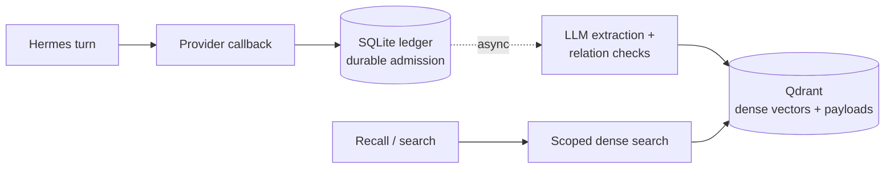

# Hermes Qdrant 记忆插件

[](https://github.com/cnkang/hermes-plugin-qdrant-memory/actions/workflows/ci.yml)
[](https://github.com/cnkang/hermes-plugin-qdrant-memory/actions/workflows/platform-compat.yml)
[](https://www.python.org/downloads/)
[](LICENSE)

> **v0.1.0 —— 有限技术预览（limited technical preview）。** 为 Hermes Agent 带来持久、私有的长期记忆：
> 对话内容会沉淀为你自有 Qdrant 存储中的可检索记忆，召回、更新与按作用域删除均由你掌控。
> 预览版要求每个目的地仅一个写入者，并遵循文档中的持久化边界。当前认证见[验证记录](docs/validation.md)。

[English](README.md) | [简体中文](README.zh-CN.md)

独立的 Hermes 原生 `MemoryProvider`：通过 Hermes 的可信 `ctx.llm` 提取记忆，
以 Qdrant named dense vector 保存向量和 schema-v1 payload。无需 Mem0 SDK 或
独立 LLM SDK，不修改 Hermes 核心，不发送插件遥测。

## 工作原理



## 安装与启用

需要 Python 3.11+、兼容的 Hermes 和可访问的 embedding 服务。最低支持的 Hermes
版本为 v0.21.5（v2026.9.24）；已测试的主机版本见 [CI 服务](docs/ci.md)。
默认 embedding 为 Ollama `qwen3-embedding:4b`，维度 2560；请准备足够的本机资源。

明确选择当前 profile 的 home，不要复用其他 profile 的数据：

```bash
export HERMES_HOME="/absolute/path/to/your/hermes-profile"
mkdir -p "$HERMES_HOME/plugins"
git clone \
  https://github.com/cnkang/hermes-plugin-qdrant-memory.git \
  "$HERMES_HOME/plugins/qdrant-memory"
ollama pull qwen3-embedding:4b
# 如果 Ollama 尚未运行，先启动服务，并保持服务可用。
hermes memory setup
hermes config set memory.provider qdrant-memory
hermes qdrant-memory init
```

依赖由 Hermes PM 准备，不要向 Hermes 管理的环境直接 pip install。
支持仓库安装的 Hermes 版本也可以使用
`hermes plugins install https://github.com/cnkang/hermes-plugin-qdrant-memory`。

需要可复现安装时，请检出发布 tag 而不是跟随 `main`（tag 见
[releases 页面](https://github.com/cnkang/hermes-plugin-qdrant-memory/releases)；
首个发布将为 `v0.1.0`）：

```bash
RELEASE_TAG=v0.1.0   # 设为已发布的 tag；首个发布将是 v0.1.0
git clone --branch "$RELEASE_TAG" --depth 1 \
  https://github.com/cnkang/hermes-plugin-qdrant-memory.git \
  "$HERMES_HOME/plugins/qdrant-memory"
```

发布说明、支持的 Hermes/Python 版本与当前限制记录在
[docs/releases/v0.1.0.md](docs/releases/v0.1.0.md)；`main` 始终是开发线。

本地开发也可以将 checkout 链接到一个专用、可丢弃的 profile：

```bash
mkdir -p "$HERMES_HOME/plugins"
ln -s /path/to/hermes-plugin-qdrant-memory "$HERMES_HOME/plugins/qdrant-memory"
hermes memory setup
hermes config set memory.provider qdrant-memory
```

修改配置后重启相应 Hermes runtime 或开始新会话。插件不会在进行中的会话里
重建系统提示或工具集合，以保持 prompt cache。包安装方式提供
`hermes_agent.memory_providers` entry point，并保留同目录的 CLI 和配置接口。

## 已实现能力

- embedded、自托管 Server 和 Qdrant Cloud 使用统一 client。
- Ollama `/api/embed` 与 OpenAI-compatible `/v1/embeddings`；校验响应数量、
  维度、有限非零向量和 embedding pipeline fingerprint。
- 继承主 LLM、Hermes auxiliary task，以及通过宿主信任门禁的 provider/model 覆盖。
- user/agent 作用域检索，按精确 ID 校验后更新或删除。
- Hermes 将 provider 回调交给插件后，turn 会先写入私有 SQLite 账本，再由串行
  后台 worker 提取和提交；会话缓存检索。
- 基于权威 `previous_content` 镜像 builtin memory，支持重试和崩溃恢复。
- Mem0 JSON/Qdrant 只读迁移，保留来源 ID、支持 dry-run/resume/verify 和增量更新。
- 只读 `list` 盘点、便携 `export`（Mem0 可导入 JSON）与带写入围栏的持久化
  作用域 `delete-all`。

与托管式记忆服务不同，记忆数据保存在你自己的 Qdrant 目的地，插件不调用任何外部
记忆服务。插件私有的 SQLite 账本（待处理操作、去重/重试记录与会话映射）保存在
本地 Hermes home，请与 Qdrant 数据一并保留和备份。从 Mem0 的迁移是单向的，
0.1 不支持向量复用或 hybrid 检索。

相似度仅用于筛选需要复核的候选。事实关系 `SAME` 才跳过，`SUPERSEDES` 更新，
`CONFLICT` 新增并记录关联，`UNRELATED` 新增。迁移按 source ID 映射，不做语义合并。

四个模型工具为 `qdrant_memory_search`、`qdrant_memory_add`、
`qdrant_memory_update`、`qdrant_memory_delete`，维护操作通过 CLI 完成：

```bash
hermes qdrant-memory status
hermes qdrant-memory init
hermes qdrant-memory doctor
hermes qdrant-memory stats
hermes qdrant-memory verify
hermes qdrant-memory retry
```

`status` 不访问网络；`doctor`/`verify` 探测已有 collection，不创建或修复它。
首次配置后运行 `init`：探测 embedding，创建 collection、写入 pipeline fingerprint，
并为 Server/Cloud 建立 payload 索引。它不调用 LLM 或写入对话记忆；重复运行会
校验现有 collection，维度、距离或 fingerprint 不兼容时拒绝继续，不覆盖已有数据。
发现已有 collection 时，`init` 提示选择 `use`（回车默认）或 `clear`（清空重建）。
`use` 校验 named dense 向量、维度、距离和 pipeline fingerprint，并逐条检查已有
记忆的 payload、内容 hash 和向量；验证失败时返回非零退出码。已有数据但没有
可信 fingerprint 的 collection 不能直接复用。`clear` 先验证 embedding 服务，再删除
目标 collection 的全部数据并重建，同时清除该目标的本地重放任务和迁移记录，防止
旧记忆恢复；其他 collection 的账本和会话来源隔离记录保留。清空操作无法撤销，
远端重建失败时会保留恢复意图，需重新运行 `init` 继续恢复；Qdrant 与本地账本
属于两个系统，清空和重建仍不保证原子操作。
清空中断后，其他目标操作返回 `reset_recovery_required`；在同一目的地重新运行
`init`，完成已授权的重置后再启用 provider。
脚本调用须显式传入 `--existing use` 或 `--existing clear`；后者即授权删除。
`--collection NAME` 只覆盖本次命令的目标，后续 agent 使用的目标仍来自配置文件。
所有部署模式的 `init`、`migrate` 和 `retry` 都要求独占写入权。OS lease 只协调
使用该 profile destination 的本机进程，不是分布式锁；运行前需停止所有主机上
正在向同一 destination 写入的 Hermes 会话或 gateway。若 `doctor` 已报告
`ok: true`，collection 已就绪，无需再次初始化；远端 `doctor`、`stats` 和 `verify`
可在 writer 运行时检查状态。
`retry` 重试已准备的操作，并让原始失败事件在下次 provider 启动时重新提取。
维护 embedded 数据库前停止 agent：本地持久化只允许一个 client 进程持有锁。

## 记忆盘点、导出与按作用域删除

```bash
hermes qdrant-memory list                        # 只读盘点
hermes qdrant-memory export --output backup.json # 可再导入的便携 JSON
hermes qdrant-memory delete-all --user alice --confirm
```

`list` 列出已存记忆的作用域、来源与时间戳，以及该目的地的待处理/失败操作计数
（`--user`/`--agent` 过滤；两者都不给即覆盖整个 collection，`--limit` 限制条数，
单独使用 `--agent` 会被拒绝）。`export` 将全部记忆（可限定作用域）写出为 Mem0
导入器可接受的便携 JSON，可用
`hermes qdrant-memory migrate mem0 --source-json backup.json` 恢复到新的目的地
（导入会重新 embedding；0.1 不支持向量复用）。往返保留文本、作用域、分类与
时间戳：Mem0 迁移来的记忆会恢复到同一 point，原生记忆在导出记录中保留原
point UUID 作为来源信息。导出文件仅属主可读，已存在时必须显式 `--force` 才覆盖。
导出仅覆盖已存记忆——待处理事件、重试历史与崩溃恢复状态保留在本地账本中；
如需完整恢复点，请一并备份 profile home。

`delete-all` 持久删除一个作用域（user×agent 对）的已存记忆与待处理工作（必须显式
`--user`）：先写入 reset 风格的删除意图，为每个枚举到的 point 以及该作用域内所有
已准备的写入（含 point 尚未落库的写入）登记删除围栏，同时使该作用域内"已接收但
尚未提取"的轮次事件失效，随后以一次过滤删除清除该作用域，并在确认作用域为空后
才清除意图。注意作用域是精确的 (user, agent) 组合：省略 `--agent` 只选"无 agent"
作用域，而默认 profile 作用域带 agent（`hermes`）——请用 `--agent hermes` 定向它，
或用 `--all-agents` 删除该用户的全部 agent 作用域；未用 `--all-agents` 时，若其他
agent 作用域仍有记忆，结果会给出 `other_agent_scopes`。字面量 `*` 只是普通 agent
id、不是通配符。`--dry-run` 预览各作用域
条数；`--confirm` 授权删除。删除中断会 fail-closed：其他命令与 provider 启动都会
返回 `scope_delete_recovery_required`，需 `delete-all --confirm` 恢复完成后才能继续。
删除意图带版本且显式：无法区分"单 agent 的 `*`"与"全部 agent"的旧版意图会被拒绝
（`scope_delete_legacy_intent`），须用 `--resolve-legacy single_agent` 显式消歧
（仅当记录的 agent 为 `*` 或缺失时，才可用 `--resolve-legacy all_agents`）
后才会执行。删除后新接收的轮次仍可写入新记忆；删除前已接收的内容——已存记忆、已准备的写入与
未提取的轮次事件——都会被移除或失效。`list`、`export`、`delete-all` 不依赖
embedding 服务。

## 数据流与隐私

本 provider 只会把数据发往你配置的服务。各组件携带的内容与去向：

| 组件 | 携带内容 | 去向 |
| --- | --- | --- |
| 对话/agent 轮次 | 你的对话内容 | Hermes 会话配置的模型 |
| 记忆提取（`llm.mode: inherit`） | 本轮用户与助手的文本 | 同一会话模型——主模型在云端时，轮次文本会到达该云端 |
| 事实关系判断 | 候选记忆与相似的已存记忆 | 与提取相同的路由；仅在相似度选中复核候选时触发 |
| 向量化（`embedding`） | 记忆与搜索文本 | 默认本地 Ollama，或你配置的 OpenAI 兼容端点 |
| 存储（`qdrant`） | 记忆 payload 与来源信息；账本保留在本地 | 本地 embedded、自托管 server 或 Qdrant Cloud |

三种常见部署：

| 部署 | 对话模型 | 提取 LLM | 向量化 | 存储 |
| --- | --- | --- | --- | --- |
| 全离线 | 本地（如 Ollama） | 继承本地模型 | 本地 Ollama | 本地 embedded |
| 混合 | 云端 | 默认继承云端模型 | 本地 Ollama | 本地 embedded |
| 全云端 | 云端 | 云端 | OpenAI 兼容端点 | Qdrant Cloud |

全离线部署需要同时为对话模型与向量化准备足够的本机算力：验证期间，24 GB 主机上
27B 本地对话模型加本地向量化已超出可用显存，本地模型每轮可能耗时数分钟。请按此
规划资源，或选用更小的本地模型。

混合部署中，提取与关系判断默认继承会话模型；若对话文本不应到达主模型的
provider，可将提取路由到其他模型（`llm.mode: task` 并结合插件的辅助任务解析到
本地模型，或 `llm.mode: override` 显式指定 provider 与模型）。提取指令会排除
明显的凭据与瞬时状态，但任何被配置的 LLM 或 Qdrant 目的地都可能看到其处理的
记忆内容，请据此评估信任边界。本地账本的逻辑清理不等于安全擦除——见
[运维文档](docs/operations.md)与[安全文档](docs/security.md)（英文）。

提取与关系判断通过 Hermes 辅助调用执行，其按任务超时默认 30 秒，本地慢模型很容易
超时。全本地部署请调大 `auxiliary.qdrant_memory_extraction.timeout`（秒）；超时的
提取会保留为失败工作，可用 `hermes qdrant-memory retry` 重新排队。

## 配置与迁移

行为配置位于 `$HERMES_HOME/qdrant-memory.json`，凭据放在当前 profile 的 Hermes
secret scope。默认 embedded 数据位于 `$HERMES_HOME/qdrant-memory/qdrant`。
`hermes memory setup` 检测当前 profile 环境中的 `QDRANT_URL` 和 `QDRANT_API_KEY`，
已有值直接使用并跳过对应输入，只提示变量已设置，不显示其内容。两项分别检测，
缺失项仍需输入；环境 URL 优先于旧配置 URL，保存环境引用而不复制值或密钥。
Server 默认地址为 `http://127.0.0.1:6333`；Cloud 要求 HTTPS 和 Database API key。
详细示例、默认值、OpenAI-compatible embedding、LLM 路由及显式 fallback 见
[配置文档](docs/configuration.md)（英文）。

迁移前备份来源，并使用独立目标 collection：

```bash
hermes qdrant-memory migrate mem0 --source-json /path/to/export.json --dry-run
# 正式迁移前，所有部署模式都需停止同一目标的 writer。
# 后台服务用以下命令；CLI 会话用 /exit，前台 gateway 用 Ctrl-C。
hermes gateway status
hermes gateway stop
hermes gateway status
hermes qdrant-memory migrate mem0 --source-json /path/to/export.json \
  --target-collection hermes_qdrant_memory --resume --verify
hermes qdrant-memory verify --collection hermes_qdrant_memory
hermes qdrant-memory stats --collection hermes_qdrant_memory
```

仅在迁移和验证成功后，恢复原先运行的后台服务：

```bash
hermes gateway start
hermes gateway status
```

若提示 `WriterBusyError` / `writer_busy`，说明仍有会话或 gateway 持有写入锁，
不是迁移数据格式错误。用 `hermes gateway list` 检查其他 profile，停止相关 writer
并等待后台请求退出后，重跑原命令；不要删除锁文件、`state.db` 或清空 collection。
`dry-run` 不申请写入锁，也不探测目标服务，因此成功不代表可以立即正式迁移。
前台 gateway 迁移后用 `hermes gateway run` 恢复；仅使用 CLI 时重新运行 `hermes`。
共享 gateway 停机会影响其他 profile；其他机器上的 writer 也需协调停止。
已开始但中断或存在失败操作时，修正原因后保持同一来源、目标和 embedding pipeline：

```bash
hermes qdrant-memory migrate mem0 --source-json /path/to/export.json \
  --target-collection hermes_qdrant_memory --resume --retry-failed --verify
hermes qdrant-memory verify --collection hermes_qdrant_memory
```

默认重新 embedding。`--resume` 匹配相同 snapshot、目标和 pipeline；失败操作需要
`--retry-failed`。验证逐条检查 ID、scope 和 payload hash，数量相等不足以证明迁移
正确。来源 collection 不会被修改；返回 Mem0 时修改 provider 配置并重启。
被取消的迁移记录以 `SUPERSEDED` 终态结束，不会冒充成功写入；resume 保留后续删除
意图，`--verify` 返回 `migration_superseded` 和非零退出码。只要仍有失败记录，
`--verify` 先返回 `migration_incomplete`：先修复失败并 resume，再审查冲突或新导入。
只有明确启动新导入或更改来源快照才能重新规划。
恢复按有限水位分批读取 operation/event；保留的账本历史仍需监控磁盘容量。
支持的输入、Qdrant 来源和回退步骤见[迁移文档](docs/migration-from-mem0.md)（英文）。

## 运行、安全与限制

SQLite 账本可能保存原始 turn 和待提交记忆。事件提交后会逻辑清除事件正文；操作
提交或被 supersede 后也会清除正文，但未完成迁移 manifest 仍引用的操作除外。行的
身份/状态信息和 manifest 会保留；PENDING/FAILED 工作会保留正文以支持恢复。账本行和
manifest 没有按时间过期的策略。删除 Qdrant 记忆不会清除仍在等待或失败的账本任务。
`state.db`、SQLite WAL/SHM sidecar、快照和备份都应按敏感数据管理；停止 agent 后再
一起备份账本与 embedded 数据库。执行 `init --existing clear` 会清除选中 collection
对应的账本行，但逻辑清除/重置不保证擦除磁盘页面或已有备份。不要删除 `state.db` 来
恢复失败；先排查配置与服务再 retry。embedding 模型、维度或 fingerprint 改变时需要新
collection 和显式迁移。

插件的持久化保证从 Hermes 调用 `sync_turn` 并且插件将事件提交到 SQLite 后开始。
Hermes 当前通过内存后台队列提交该回调；宿主进程突然退出或有界 shutdown 可能丢弃
尚未进入插件的任务。账本接纳后，插件会在重启时重放待处理事件和已准备操作；插件
账本无法让更早的宿主队列变成持久队列。

工具参数不能覆盖调用者 scope；bot 和非 primary agent 不自动写记忆。召回文本是不
可信数据。安全、恢复流程和设计说明见[安全](docs/security.md)、
[运维](docs/operations.md)、[故障排查](docs/troubleshooting.md)、
[架构](docs/architecture.md)文档（英文）。

## 兼容性与范围

v0.1 实现 dense retrieval。Hybrid sparse vector、RRF/DBSF、rerank、recency
weighting 属于后续范围；不支持的配置会被拒绝。named `dense` vector 为未来的
sparse vector 保留了演进路径。

embedding `inherit` 采用特性探测，且需要显式 `inherit_fallback`。未来的宿主
facade 必须提供 `dimensions`、`fingerprint`、`embed_documents()` 和
`embed_query()`。当前 Hermes 未声明提供全局 embedding facade。

兼容性要求 Hermes `MemoryProvider`、checkpoint v2、可信 turn author、权威
`previous_content`、scoped secrets 和 context thread；更早的版本契约不完整。
最低支持版本为 v0.21.5（v2026.9.24）。已测试的环境和仍需实机验证的项目见
[验证记录](docs/validation.md)。部署前请阅读[配置](docs/configuration.md)、
[迁移](docs/migration-from-mem0.md)、[安全](docs/security.md) 和
[运维](docs/operations.md)。

## 开发验证

从 Hermes checkout 使用 PM 构建隔离环境，再运行宿主 canonical runner：

```bash
cd /path/to/hermes-agent
python -m pm.build_env --source /path/to/hermes-agent --group test \
  --export-requirements /tmp/hermes-qdrant-test-requirements.txt
python -c 'import sys, tomllib; from pathlib import Path; p = tomllib.loads(Path(sys.argv[1]).read_text()); print("\n".join(p["project"]["dependencies"] + p["dependency-groups"]["test"]))' \
  /path/to/hermes-plugin-qdrant-memory/pyproject.toml >> /tmp/hermes-qdrant-test-requirements.txt
python -m pm.build_env --out /path/to/hermes-plugin-qdrant-memory/.test-env \
  --requirements /tmp/hermes-qdrant-test-requirements.txt
HERMES_PYTHON=/path/to/hermes-plugin-qdrant-memory/.test-env/bin/python \
  scripts/run_tests.sh /path/to/hermes-plugin-qdrant-memory/tests -j 1 --file-retries 0
```

插件的 `test` 开发依赖组从 `pyproject.toml` 读取。当前测试的宿主 PM 只导出
运行时依赖，因此先追加插件运行时依赖和测试组，再构建组合环境。

在插件 checkout 中运行真实 embedding pilot：

```bash
PYTHONPATH=/path/to/hermes-agent .test-env/bin/python scripts/evaluate.py
```

评估使用临时 embedded 数据库和 UTF-8 JSON；自定义数据集包含带 `id`/`text` 的
`memories`，以及带 `query`/`relevant_ids` 的 `queries`。12-topic 合成 pilot 只用于
回归基线，不代表生产召回质量。当前默认 fixture 已扩展为 24 条带标签的查询，
覆盖中文、英文、混合语言和 hard-negative 场景；后续实测见最终审查报告。
重放与账本存储的独立合成测量见[恢复基准](docs/recovery-benchmark.md)（英文）。

提交前运行 Ruff lint 和格式检查，并按[开发指南](docs/development.md)（英文）
安装仓库 pre-commit hook。hook 检查暂存内容；CI 运行 lint、Python 测试、
Snyk 与 SonarCloud。已测试的主机版本与各 lane 见 [CI 服务](docs/ci.md)。

CI 运行测试、SonarCloud 质量门禁与 Snyk 依赖/源码扫描。
见[CI 配置](docs/ci.md)（英文）。

## 许可证

MIT，Copyright © 2026 Kang Liu。详见 [LICENSE](LICENSE)。
